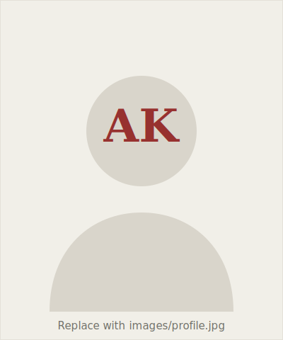

::: {.profile-header}
{.profile-photo fig-alt="Portrait placeholder for Arvind Karunakaran"}

::: {.profile-intro}
# Arvind Karunakaran

::: {.profile-affil}
Assistant Professor of Management Science & Engineering, and (by courtesy) of Sociology 
Stanford University 
Core faculty — Center for Work, Technology, and Organization (WTO) · Stanford Technology Ventures Program (STVP) 
Faculty affiliate — Stanford Institute for Human-Centered AI (HAI) · Digital Economy Lab
:::
:::
:::

::: {.lede}
I study **authority and accountability in the workplace**, especially in the
context of technological change. My current work examines **human–AI
augmentation** and its consequences for professionals and organizations. I use
ethnographic and field-based methods, complemented by comparative-historical
analysis of archival data and computational analysis of large text corpora. My
research appears in *Administrative Science Quarterly*, *Organization Science*,
*Academy of Management Journal*, *Academy of Management Annals*, *Research
Policy*, and *JASIST*.
:::

[Research](research.qmd){.btn-doc} &nbsp; [Publications](publications.qmd){.btn-doc}

## Selected Publications

::: {.pub-list}

::: {.pub-item}
[Karunakaran, A.]{.me} (2024). &ldquo;Frontline Professionals in the Wake of Social Media Scrutiny: Examining the Processes of Obscured Accountability.&rdquo; *Administrative Science Quarterly*, 69(3), 747–790.
[[DOI](https://doi.org/10.1177/00018392241256303){.no-underline}]{.pub-links}
:::

::: {.pub-item}
[Karunakaran, A.]{.me}, Lebovitz, S., Narayanan, D., Rahman, H. (2025). &ldquo;Artificial Intelligence at Work: An Integrative Review on the Impact of AI on Workplace Inequality.&rdquo; *Academy of Management Annals*, 19(2). [Equal Contribution]{.equal-contrib}
[[DOI](https://doi.org/10.5465/annals.2023.0230){.no-underline}]{.pub-links}
:::

::: {.pub-item}
[Karunakaran, A.]{.me} (2022). &ldquo;Status-Authority Asymmetry between Professions: The Case of 911 Dispatchers and Police Officers.&rdquo; *Administrative Science Quarterly*, 67(2), 423–468.
[[DOI](https://doi.org/10.1177/00018392211059505){.no-underline}]{.pub-links}
:::

::: {.pub-item}
[Karunakaran, A.]{.me}, Orlikowski, W.J., Scott, S.V. (2022). &ldquo;Crowd-based Accountability: Examining how Social Media Commentary Reconfigures Organizational Accountability.&rdquo; *Organization Science*, 33(1), 170–193.
[[DOI](https://doi.org/10.1287/orsc.2021.1546){.no-underline}]{.pub-links}
:::

:::

[See all publications →](publications.qmd)

## Recent News

::: {.news-list}
- ::: {.news-date}
  2025
  :::
  ::: {.news-body}
  Named to the **Thinkers50 Radar** cohort and recognized as an **Ascendant Scholar** by the Western Academy of Management.
  :::
- ::: {.news-date}
  2025
  :::
  ::: {.news-body}
  &ldquo;Artificial Intelligence at Work&rdquo; (with Lebovitz, Narayanan & Rahman) published in *Academy of Management Annals*.
  :::
- ::: {.news-date}
  2024
  :::
  ::: {.news-body}
  Received the **W. Richard Scott Article Award** (ASA, OOW Section) and the **Responsible Research in Management Award**.
  :::
:::

[All news →](news.qmd)
