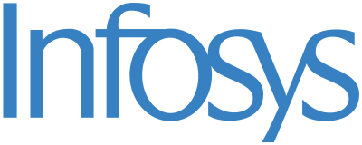
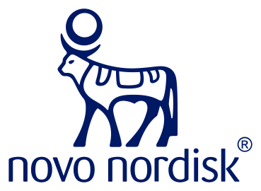

::: {.speaker-hero}
::: {.speaker-hero-intro}
::: {.lede}
I help senior leaders navigate the **organizational** side of AI. My sessions
translate multi-year field research inside organizations undergoing AI-driven
transformation into practical frameworks, enterprise case studies, and hands-on
exercises — spanning AI strategy, execution and scaling, human–AI augmentation,
agentic AI adoption, change management, governance, and measurement.
:::

I deliver this work as keynotes, interactive executive sessions, and half- to
multi-day programs, tailored to the audience, industry, and format.

[Enquire about a session &rarr;](mailto:arvindka@stanford.edu){.btn-doc .no-underline}
:::

{.speaker-photo fig-alt="Portrait of Arvind Karunakaran"}
:::

## Featured Talks

::: {.video-grid}
::: {.video-item}
::: {.video-frame}
<iframe src="https://www.youtube-nocookie.com/embed/orSe5rEKOuo" title="The Future of AI at Work — Stanford Engineering" loading="lazy" allow="accelerometer; clipboard-write; encrypted-media; gyroscope; picture-in-picture; web-share" allowfullscreen></iframe>
:::
[**The Future of AI at Work** · Stanford Engineering, *The Future of Everything* podcast with Russ Altman]{.video-caption}
:::

::: {.video-item}
::: {.video-frame}
<iframe src="https://www.youtube-nocookie.com/embed/U4QWzTPg1gI" title="AI in the Workplace: Rethinking Skill Development — Stanford Online" loading="lazy" allow="accelerometer; clipboard-write; encrypted-media; gyroscope; picture-in-picture; web-share" allowfullscreen></iframe>
:::
[**AI in the Workplace: Rethinking Skill Development** · Stanford Online webinar]{.video-caption}
:::
:::

## Selected Clients

I have taught and facilitated executive sessions for leaders across industries on
technology strategy, human–AI augmentation, agentic AI adoption and scaling, and
organizational transformation and change management — including:

```{=html}
<div class="logo-wall">
  <div class="logo-cell"></div>
  <div class="logo-cell"></div>
  <div class="logo-cell"></div>
  <div class="logo-cell"></div>
  <div class="logo-cell"></div>
  <div class="logo-cell"></div>
  <div class="logo-cell"></div>
  <div class="logo-cell"></div>
  <div class="logo-cell"></div>
  <div class="logo-cell"></div>
  <div class="logo-cell"></div>
  <div class="logo-cell"></div>
  <div class="logo-cell"></div>
  <div class="logo-cell"></div>
  <div class="logo-cell"></div>
  <div class="logo-cell"></div>
  <div class="logo-cell"></div>
  <div class="logo-cell"></div>
</div>
```

::: {.client-industry}
- [Consulting & Professional Services]{.ci-label}McKinsey & Company · Boston Consulting Group · Accenture · PwC · Deloitte
- [Consumer, Retail & Industrial]{.ci-label}Unilever · PepsiCo · Walmart · Henkel
- [Financial Services]{.ci-label}Barclays · Charles Schwab · TIAA · Bank of New Zealand · National Australia Bank
- [Technology & Services]{.ci-label}Infosys
- [Healthcare, Pharma & Nonprofit]{.ci-label}Novo Nordisk · DaVita · American Heart Association
:::

## Executive Sessions & Workshops

Each session runs as a talk (45–60 min), an interactive executive session
(80–90 min), or a half-day workshop with hands-on exercises — delivered in person
or online, and combinable into full-day and multi-day executive programs. All
sessions are tailored to the audience and industry.

[I. AI Strategy & Execution]{.session-theme}

::: {.session-list}
- [AI Strategy and Execution: From Vision to Enterprise Value]{.s-title}<br>
  [An enterprise-wide framework for managing AI as a strategic asset: the three
  waves of AI (predictive, generative, agentic), build-buy-partner choices,
  escaping "pilot purgatory," and connecting AI to measurable value — closing
  with a 90-day roadmapping exercise.]{.s-desc}
- [Leading with AI: Executive Visioning & Roadmapping]{.s-title}<br>
  [A working session for leadership teams on where durable advantage comes from
  in an AI-driven market, followed by a structured visioning and roadmapping
  exercise on a five-stage AI maturity model.]{.s-desc}
:::

[II. Building & Scaling Enterprise AI]{.session-theme}

::: {.session-list}
- [Enterprise AI to Create Business Value]{.s-title}<br>
  [Using a "three lenses" framework — strategic design, power and politics, and
  culture — to structure, scale, and redesign work around AI, including
  machine-in-the-loop workflows and operating-model choices.]{.s-desc}
- [Agentic AI in Enterprises: Adoption, Orchestration & Scaling]{.s-title}<br>
  [Why agentic initiatives stall between pilot and production, and how leaders
  handle orchestration (multi-agent coordination, human-in-the-loop controls,
  evaluation infrastructure) and scaling across functions.]{.s-desc}
:::

[III. People, Work, Culture & Organizational Change]{.session-theme}

::: {.session-list}
- [AI, Change Management & Organizational Transformation]{.s-title}<br>
  [The change management behind building in-house AI capability: why internal
  efforts stall, how to design the division of labor across the AI stack, and why
  to reorganize workflows rather than automate isolated tasks.]{.s-desc}
- [Reskilling, Role Redesign & Human–AI Augmentation]{.s-title}<br>
  [The "last-mile" problem of adoption and a task-first approach to reskilling and
  role/workflow redesign, anchored by a hands-on task-mapping and redesign
  exercise.]{.s-desc}
:::

[IV. Governance, Metrics & Value]{.session-theme}

::: {.session-list}
- [Organizational Governance, Implementation & Use of AI]{.s-title}<br>
  [Two frames for capturing value — substitution versus pie-expansion — governing
  across the AI stack, and navigating the "jagged frontier" of AI capability.]{.s-desc}
- [Metrics for Measuring Value from AI]{.s-title}<br>
  [Why input-centric metrics (time saved, tokens, lines of code) backfire, and two
  better anchors: the dollar value of higher-value work performed per role, and
  business-unit capacity expansion.]{.s-desc}
:::

## Startup Advising

I also advise early-stage startups as a **technical advisor**. I currently serve as
a technical advisor to [Fore Enterprise](https://foreenterprise.com/), an AI
solutions-architecture firm that helps companies deploy AI to improve efficiency,
reduce cost, and build new solutions across industries.

## Keynotes & Invited Talks

I have delivered invited keynotes and presentations at conferences and institutions
including **The AI Summit**, **Harvard Business School**, **Wharton**, **Columbia
Business School**, and **MIT Sloan**, and was featured on Stanford Engineering's
*The Future of Everything* podcast, discussing how AI is changing skills, power
dynamics, and career paths in the modern workplace.

::: {.booking}
Interested in a keynote, executive session, workshop, or advisory engagement?
[Get in touch &rarr;](mailto:arvindka@stanford.edu)
:::
